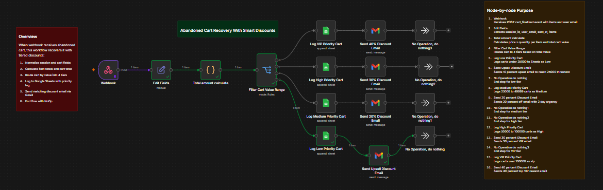

# 🛒 WooCommerce Abandoned Cart Recovery Automation Workflow

This folder contains an exported n8n workflow designed to automatically recover abandoned carts in WooCommerce using smart, tiered discount strategies. It integrates **WooCommerce Webhooks**, **Google Sheets**, and **Gmail** to capture cart abandonments, categorize them by cart value, and deliver targeted discount emails to boost store revenue.

---

---

## 🎯 Key Benefits

* ⚡ **Automated Revenue Recovery:** Automatically re-engages shoppers who abandoned their checkout with timely incentives.
* 🏷️ **Smart Tiered Discounts:** Offers targeted discount levels (10%, 20%, 30%, 40%) based on total cart value to maximize profit margins.
* 📊 **Centralized Analytics Logging:** Records every abandoned cart directly into Google Sheets tagged by priority level for easy tracking.
* 📧 **High-Converting HTML Emails:** Delivers beautiful, customized promotional emails via Gmail with direct checkout call-to-actions.

---

## 📋 Workflow Overview

The automation runs through three core operational phases:

### 1. 🛒 Cart Capture & Total Calculation
* **Trigger:** Listens via Webhook for abandoned cart events (`cart_finalized`) containing session details, user email, and line items.
* **Actions:**
  * Extracts key session data (`session_id`, `user_email`, `items`, `sent_at`).
  * Calculates individual item amounts (Price × Quantity) and determines total cart value.

### 2. 🔀 Smart Tier Routing & Discount Management
* **Logic:** Evaluates total cart value and routes the execution path through 1 of 4 priority tiers:
  * **Low Priority (< Rs 25,000):** Sends a 10% upsell incentive email encouraging shoppers to reach the Rs 25,000 threshold.
  * **Medium Priority (Rs 25,000 – 49,999):** Sends a 20% discount offer email with a 2-day urgency deadline.
  * **High Priority (Rs 50,000 – 100,000):** Sends an exclusive 30% VIP discount offer email.
  * **VIP Priority (> Rs 100,000):** Sends a premium 40% VIP reward discount email.

### 3. 📊 Data Logging & Customer Outreach
* **Actions:**
  * Appends cart details along with assigned priority status to Google Sheets for record-keeping.
  * Sends personalized HTML discount emails directly to the customer's Gmail address.

---

## 🛠️ Apps & Integrations Used

* **n8n** (Core Automation Engine)
* **WooCommerce Webhooks** (Cart Abandonment Event Trigger)
* **Google Sheets** (Cart Data Logging & Status Tracking)
* **Gmail** (Automated Discount Email Delivery)

---

## 🚀 How to Import and Use

1. Download the `.json` workflow file from this repository.
2. Open your **n8n** dashboard and click **Import from File**.
3. Connect your credentials for **Google Sheets** and **Gmail**.
4. Set up your Webhook URL inside your WooCommerce store or cart tracking plugin.
5. Activate the workflow!
