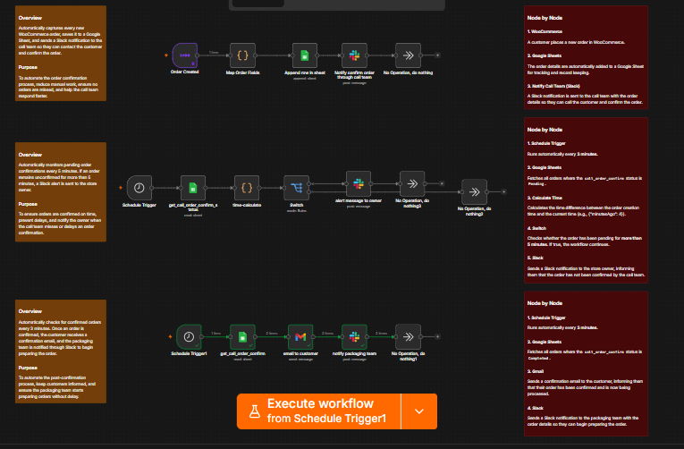

# 🚀 WooCommerce Order Operations Automation Workflow

This folder contains an exported n8n workflow designed to streamline order confirmation, escalation, and packaging operations for WooCommerce stores. It integrates **WooCommerce**, **Google Sheets**, **Slack**, and **Gmail** to ensure fast order processing and complete team synchronization.

---

---

## 🎯 Key Benefits

* ⚡ **Faster Order Confirmation:** Instant Slack notifications enable the call team to contact customers immediately after purchase.
* 🚨 **Automated Escalations:** Prevents delayed orders by alerting the store owner if an order remains unconfirmed for over 5 minutes.
* 📊 **Centralized Record Keeping:** Automatically logs every incoming order directly into Google Sheets without manual data entry.
* 📦 **Seamless Team Alignment:** Keeps the Call Team, Store Owner, and Packaging Team connected in real-time.
* 📧 **Better Customer Experience:** Automatically sends order confirmation emails via Gmail as soon as the status updates.

---

## 📋 Workflow Overview

The automation is divided into three core phases:

### 1. 🛒 New Order Logging & Call Team Notification
* **Trigger:** Listens for new orders placed on WooCommerce.
* **Actions:**
  * Appends new order details directly into a Google Sheets database for tracking.
  * Sends an instant Slack notification to the **Call Team** with customer and order details so they can contact the client and confirm the order.

### 2. ⏳ Pending Order Monitoring & Owner Escalation
* **Trigger:** Runs on a scheduled timer (Every 3 minutes).
* **Logic:** Reads Google Sheets for orders where the confirmation status is `Pending` and calculates the time elapsed since creation.
* **Actions:**
  * Checks if the order has been pending for **more than 5 minutes**.
  * Escalates and sends an alert message to the **Store Owner** on Slack if the call team delays confirmation.

### 3. ✅ Order Confirmation & Packaging Handoff
* **Trigger:** Runs on a scheduled timer (Every 3 minutes).
* **Logic:** Checks Google Sheets for orders marked as `Completed` / Confirmed by the call team.
* **Actions:**
  * Automatically sends an Order Confirmation email to the customer via **Gmail**.
  * Posts a detailed notification to the **Packaging Team** on Slack so they can immediately start preparing the item for dispatch.

---

## 🛠️ Apps & Integrations Used

* **n8n** (Core Automation Engine)
* **WooCommerce** (E-commerce Trigger)
* **Google Sheets** (Database & Order Status Tracking)
* **Slack** (Call Team Notifications, Owner Escalations & Packaging Alerts)
* **Gmail** (Customer Order Confirmation Emails)

---

## 🚀 How to Import and Use

1. Download the `.json` workflow file from this repository.
2. Open your **n8n** dashboard and click **Import from File**.
3. Connect your credentials for WooCommerce, Google Sheets, Slack, and Gmail.
4. Set up your Google Sheet structure with necessary columns (`order_id`, `date_created`, `call_order_confirm`, etc.).
5. Activate the workflow!
